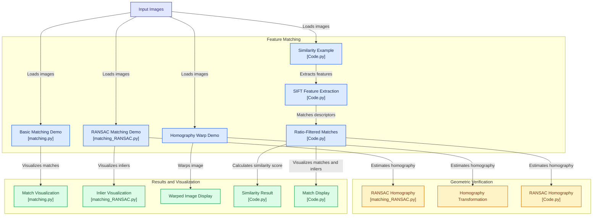

# Computer Vision 
### Similarity match

## Image Similarity and Feature Matching Workflow

```mermaid id="b7x3qm"
flowchart TD
    subgraph group_matching["Feature Matching"]
        node_similarity_script["Similarity Example<br/>[Code.py]"]
        node_sift_features["SIFT Feature Extraction<br/>[Code.py]"]
        node_ratio_matches["Ratio-Filtered Matches<br/>[Code.py]"]
        node_ransac_script["RANSAC Matching Demo<br/>[matching_RANSAC.py]"]
        node_basic_match_script["Basic Matching Demo<br/>[matching.py]"]
        node_warp_script["Homography Warp Demo"]
    end

    subgraph group_geometry["Geometric Verification"]
        node_ransac_geometry["RANSAC Homography<br/>[matching_RANSAC.py]"]
        node_warp_geometry["Homography Transformation"]
        node_similarity_geometry["RANSAC Homography<br/>[Code.py]"]
    end

    subgraph group_presentation["Results and Visualization"]
        node_match_display["Match Visualization<br/>[matching.py]"]
        node_inlier_display["Inlier Visualization<br/>[matching_RANSAC.py]"]
        node_warped_display["Warped Image Display"]
        node_similarity_result["Similarity Result<br/>[Code.py]"]
        node_similarity_display["Match Display<br/>[Code.py]"]
    end

    node_image_inputs["Input Images"]

    node_image_inputs -->|"Loads images"| node_similarity_script
    node_similarity_script -->|"Extracts features"| node_sift_features
    node_sift_features -->|"Matches descriptors"| node_ratio_matches
    node_ratio_matches -->|"Estimates homography"| node_similarity_geometry
    node_ratio_matches -->|"Calculates similarity score"| node_similarity_result
    node_ratio_matches -->|"Visualizes matches and inliers"| node_similarity_display

    node_image_inputs -->|"Loads images"| node_ransac_script
    node_ransac_script -->|"Estimates homography"| node_ransac_geometry
    node_ransac_script -->|"Visualizes inliers"| node_inlier_display

    node_image_inputs -->|"Loads images"| node_basic_match_script
    node_basic_match_script -->|"Visualizes matches"| node_match_display

    node_image_inputs -->|"Loads images"| node_warp_script
    node_warp_script -->|"Estimates homography"| node_warp_geometry
    node_warp_script -->|"Warps image"| node_warped_display

    click node_similarity_script "https://github.com/yassakamille/computer_vision-similarity_match/blob/main/SIFT/Code.py"
    click node_sift_features "https://github.com/yassakamille/computer_vision-similarity_match/blob/main/SIFT/Code.py"
    click node_ratio_matches "https://github.com/yassakamille/computer_vision-similarity_match/blob/main/SIFT/Code.py"
    click node_ransac_script "https://github.com/yassakamille/computer_vision-similarity_match/blob/main/RANSAC/matching_RANSAC.py"
    click node_basic_match_script "https://github.com/yassakamille/computer_vision-similarity_match/blob/main/RANSAC/matching.py"
    click node_warp_script "https://github.com/yassakamille/computer_vision-similarity_match/blob/main/RANSAC/applying%20homography%20transformation.py"
    click node_ransac_geometry "https://github.com/yassakamille/computer_vision-similarity_match/blob/main/RANSAC/matching_RANSAC.py"
    click node_warp_geometry "https://github.com/yassakamille/computer_vision-similarity_match/blob/main/RANSAC/applying%20homography%20transformation.py"
    click node_similarity_geometry "https://github.com/yassakamille/computer_vision-similarity_match/blob/main/SIFT/Code.py"
    click node_match_display "https://github.com/yassakamille/computer_vision-similarity_match/blob/main/RANSAC/matching.py"
    click node_inlier_display "https://github.com/yassakamille/computer_vision-similarity_match/blob/main/RANSAC/matching_RANSAC.py"
    click node_warped_display "https://github.com/yassakamille/computer_vision-similarity_match/blob/main/RANSAC/applying%20homography%20transformation.py"
    click node_similarity_result "https://github.com/yassakamille/computer_vision-similarity_match/blob/main/SIFT/Code.py"
    click node_similarity_display "https://github.com/yassakamille/computer_vision-similarity_match/blob/main/SIFT/Code.py"

    classDef toneNeutral fill:#f8fafc,stroke:#334155,stroke-width:1.5px,color:#0f172a
    classDef toneBlue fill:#dbeafe,stroke:#2563eb,stroke-width:1.5px,color:#172554
    classDef toneAmber fill:#fef3c7,stroke:#d97706,stroke-width:1.5px,color:#78350f
    classDef toneMint fill:#dcfce7,stroke:#16a34a,stroke-width:1.5px,color:#14532d
    classDef toneRose fill:#ffe4e6,stroke:#e11d48,stroke-width:1.5px,color:#881337
    classDef toneIndigo fill:#e0e7ff,stroke:#4f46e5,stroke-width:1.5px,color:#312e81
    classDef toneTeal fill:#ccfbf1,stroke:#0f766e,stroke-width:1.5px,color:#134e4a

    class node_similarity_script,node_sift_features,node_ratio_matches,node_ransac_script,node_basic_match_script,node_warp_script toneBlue
    class node_ransac_geometry,node_warp_geometry,node_similarity_geometry toneAmber
    class node_match_display,node_inlier_display,node_warped_display,node_similarity_result,node_similarity_display toneMint
    class node_image_inputs toneIndigo
```

